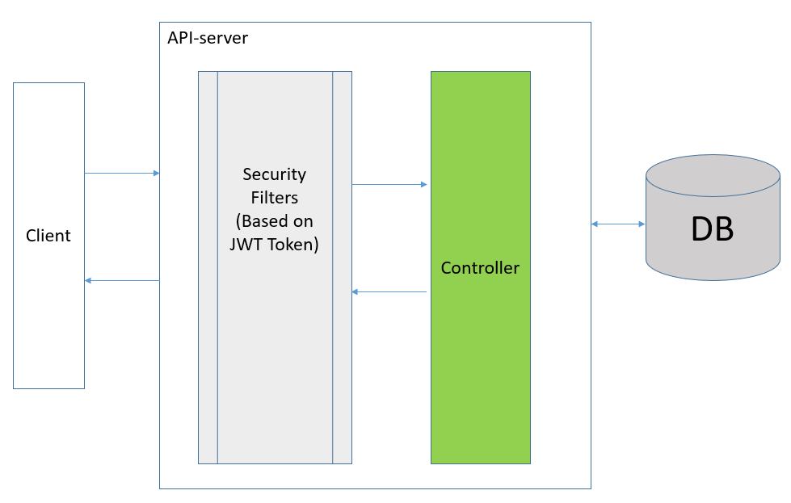
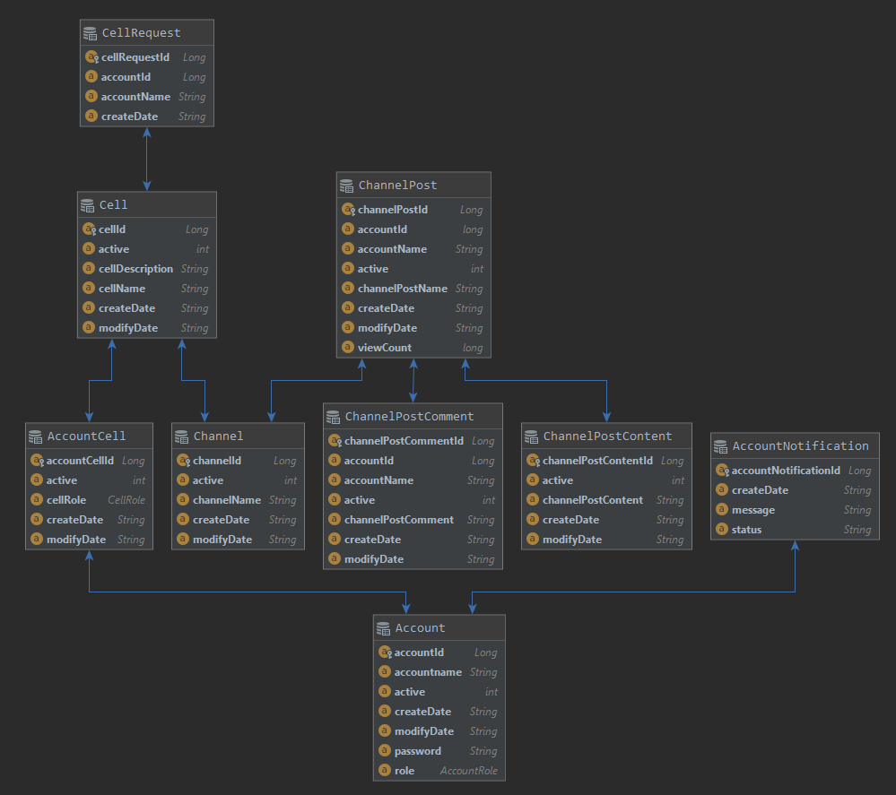
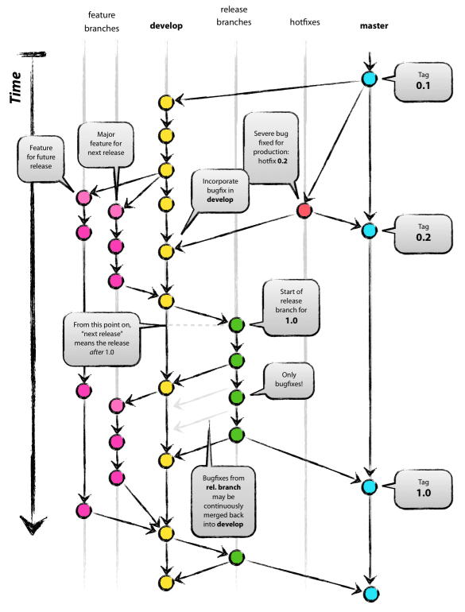

Cellit Api Server - release 1.0
=============

:rocket: Purpose of program
-------------
'Cellit' is Abbreviation of 'cell unit'.

__The Cellit concepts__ is Cell provide individual space and guarantee communication for joined each user.

Manager of cell can manage about channel and users. Forexample reject for requested join specific cell or terminate user and channel.

Release 1.0 version is focus on overall structure.


:factory: Program structure
-------------

### Technology set

|Technical Name|Value|
|:---:|:---:|
|Language|[Kotlin](https://kotlinlang.org/)|
|Framework|[Spring boot](https://spring.io/projects/spring-boot)|
|DBMS|[Postgres](https://www.postgresql.org/)|
|Persistance Framework|[JPA](https://hibernate.org/)|
|Domain Specific Language|[Querydsl](http://www.querydsl.com/)|
<br/>



In order to request Api on client need to put JWT token on 'Authorization' of http header.

<br/>

### Response as HAL - Hypertext Application Language

Every response of request has body based on `HAL - Hypertext Application Language`.

~~~
{
    "_embedded": {
        "channelPostEntityModelList": [
            {
                "channelPostId": 3,
                "channelPostName": "test2",
                "accountId": 1,
                "accountName": "ewan",
                "viewCount": 0,
                "createDate": "2020-12-10.03:55:01",
                "modifyDate": "2020-12-10.03:55:01",
                "active": 1,
                "_links": {
                    "self": {
                        "href": "http://localhost:8081/api/channels/1/channelPosts/3"
                    }
                }
            },
            {
                "channelPostId": 2,
                "channelPostName": "test2",
                "accountId": 1,
                "accountName": "ewan",
                "viewCount": 0,
                "createDate": "2020-12-10.02:49:43",
                "modifyDate": "2020-12-10.02:49:43",
                "active": 1,
                "_links": {
                    "self": {
                        "href": "http://localhost:8081/api/channels/1/channelPosts/2"
                    }
                }
            },
        ]
    },
    "_links": {
        "self": {
            "href": "http://localhost:8081/api/channels/1/channelPosts?postNameToSearch=&page=0&size=10&sort=createDate,desc"
        }
    },
    "page": {
        "size": 10,
        "totalElements": 3,
        "totalPages": 1,
        "number": 0
    }
}
~~~

<br/>

### DB ERD



:pushpin: Rule of interest for programming on thos project.
-------------
### Code convension

This project follow koltin code convension by official kotlin site.

```
https://kotlinlang.org/docs/reference/coding-conventions.html
```

<br/>

### Writing Test code

Create Test code for every each api. High stability against incidental bugs that may arise against code modifications.

* Create test code by using [Mockito](https://site.mockito.org/) for solid test code.

<br/>

### Efforts for readable and maintainable code

Coherent blocks of code and aggressive use `Query DSL` instead of `JPQL`.

~~~
SELECT a FROM Account a  JOIN FETCH a.accountCells WHERE a.accountId = :accountId
~~~

~~~Koltin
val account = QAccount.account
    val accountCell = QAccountCell.accountCell
    return from(account)
            .leftJoin(account.accountCells, accountCell).fetchJoin()
            .where(account.accountId.eq(accountId)
                    .and(accountCell.cell.active.eq(1)))
            .fetchOne()
~~~

<br/>

### Branch strategy



Cellit project manage code by follow Git Flow.

* Master : Push code whenever release code, so this branch always has recently release code.
* Hotfix : Use this branch when fix bug after release.
* Release : Deploy code on this branch. This branch has numeric on postfix each branch for express version.
* Develop : Merged code for each business of feature.
* Feature : Create Feature branch whenever start new feature and merge 'develop' branch.

A successful Git branching model : https://nvie.com/posts/a-successful-git-branching-model/


:hammer: Working with Cellit in your IDE
-------------

### Prerequisites

The following items should be installed in your setting:

* [At least Java 8 or higher](https://openjdk.java.net/)
* [Git](https://git-scm.com/)
* Your preferred IDE
    * [IntelliJ IDEA](https://www.jetbrains.com/ko-kr/idea/)
    * [VS Code](https://code.visualstudio.com/)
    * [Eclipse](https://www.eclipse.org/downloads/)
    * [Spring Tools Suite (STS)](https://spring.io/tools)
